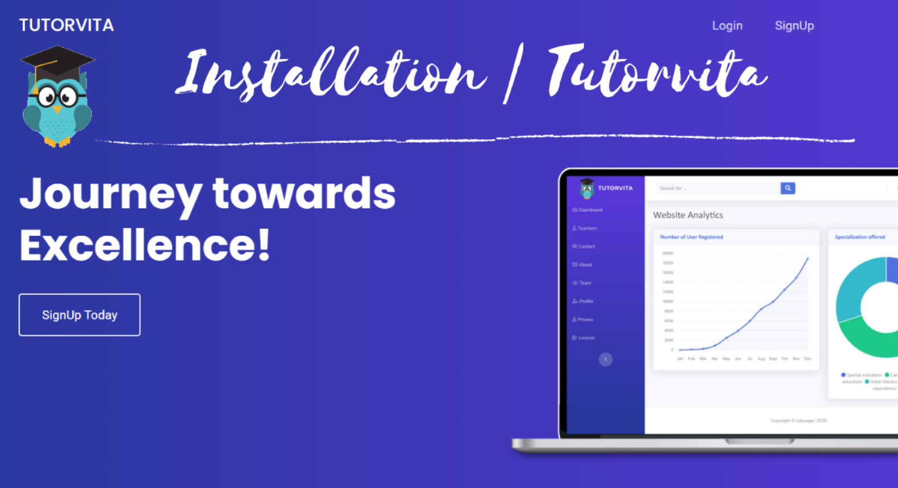

<link href="https://cdn.jsdelivr.net/npm/bootstrap@5.0.0-beta1/dist/css/bootstrap.min.css" rel="stylesheet" integrity="sha384-giJF6kkoqNQ00vy+HMDP7azOuL0xtbfIcaT9wjKHr8RbDVddVHyTfAAsrekwKmP1" crossorigin="anonymous">

<div class="jumbotron">
  <h1 class="display-4">Udayagiri's Tutorvita</h1>
  <p class="lead">With the outbreak of pandemic, the educational institutions had to be shutdown which hindered the learning of a lot of students.The students have to adapt to the online methods of learning which is now the new norm. Reaching out to teachers and resource personals is a rather difficult task. With this project, any student from any corner of the world, willing to learn something can reachout to a teacher. Anyone can create an account and seek help from our verified lecturers.</p>
  <hr class="my-4">
</div>

<p class="text-center mb-3" align="center">
<a href="https://tutorvita.herokuapp.com/"></a> 
<a href="https://tutorvita.herokuapp.com/"></a> 
<a href="https://tutorvita.herokuapp.com/"></a>  
</p>

<p class="text-center mb-3" align="center">
<a href="https://github.com/Parthiv-2020/udayagiri-scl-maxo/blob/main/README.md" class="badge badge-primary">Documentation</a>🔰
<a href="https://github.com/Parthiv-2020/udayagiri-scl-maxo/issues/new" class="badge badge-primary">Report a Bug</a>🔰
<a href="https://github.com/Parthiv-2020/udayagiri-scl-maxo/issues/new" class="badge badge-primary">Request a Feature</a>
</p>


<!-- Repo detail Stickers -->
<p align="center">                          
 <a href="https://github.com/Parthiv-2020/udayagiri-scl-maxo/issues"></a>
<a href="https://github.com/Parthiv-2020/udayagiri-scl-maxo/blob/main/LICENSE"></a>
<a href="https://github.com/Parthiv-2020/udayagiri-scl-maxo/network"></a>
</p>

<!-- TABLE OF CONTENTS -->
<details open="open">
  <summary>Table of Contents</summary>
  <ol>
    <li>
      <a href="#about-the-project">About The Project</a>
      <ul>
        <li><a href="#a-note-for-contributors">A Note for the contributors</a></li>
        <li><a href="#project-description">Project Description</a></li>
      </ul>
    </li>
    <li>
      <a href="#getting-started">Getting Started</a>
      <ul>
        <li><a href="#installation">Installation</a></li>
        <li><a href="#development">Development</a></li>
      </ul>
    </li>
    <li><a href="#contributing">Contributing / Adding Features</a></li>
  </ol>
</details>

<br />

<!-- About Project -->

## About the Project

#### A Note for Contributors

<i>
This is a official project repo for Udayagiri-scl-maxo which is a 40-day Hackathon. It is organised by Sushiksha, World Konkani Center.
This repo is monitored. Only members from team Udayagiri are allowed to do changes and do contributions. 
Thus, we are not supposed to accept any PRs from anyone other then Udayagiri team members. 
For further details, you can get in touch with the repo owner or contributors. 
</i>


#### Project Description

1. Backend Framework: **Django**
2. Front-end Framework: **Bootstrap**
3. Database used: **Sqlite**

<!-- Getting started -->

## Getting Started

### Installation 

Refer below video or instruction for setting up tutorvita in your device.
<p align="center">
<a href="https://youtu.be/hdlEnNZ_NdU" border="0" title="Tutorvita installation click to play.."> </a>
</p>
1. Fork and Clone
    <ol>
    <li>Fork the udayagiri-scl-maxo Repository</li>
    <li>Clone the repo to your local system.</li>
    </ol>

2. Create a Virtual Environment for the Project

    Install pipenv package
    ```
    pip install pipenv
    ```

    Run following command to create virtual env and install necessary dependecies. 

    ```bash
    pipenv shell
    pipenv install
    ```
    If `pipenv install` does not work use:
    ```
    pip install -r requirements.txt
    ```

### Development

   
3. Make migrations/ Create db.sqlite3

    ```bash
    python manage.py makemigrations
    python manage.py migrate
    ```

6. Create a super user.
    In Django, if you want to access admin page, you need to create an account with staff status first.
    ```djangotemplate
    python manage.py createsuperuser
    ```
   Then select your username and password. You can bypass a common password for development purposes.
   
7. Run the server on localhost:
    ```bash
    python manage.py runserver
    ```
   

## Contributing
   Pull request are only welcommed by Udayagiri team members, if you are intereseted in the project please raise a issue regarding the same.
